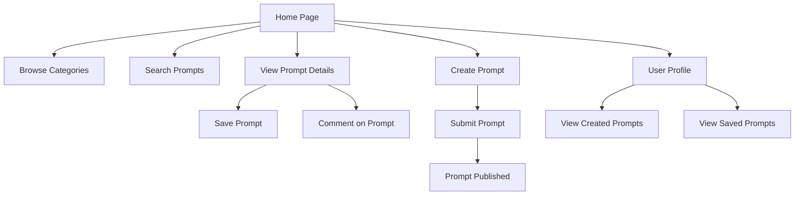

## 1. Product Overview
移动端提示词分享网站，方便用户发现、分享和管理AI提示词
- 解决用户在使用AI工具时缺乏优质提示词的问题，为用户提供一个集中的提示词资源库
- 目标用户为AI工具使用者，包括设计师、内容创作者、开发者等
- 产品价值在于提高AI工具使用效率，促进提示词知识共享

## 2. Core Features

### 2.1 User Roles
| Role | Registration Method | Core Permissions |
|------|---------------------|------------------|
| Guest | None | Browse and search prompts |
| Registered User | Email registration | Browse, search, create, edit, and share prompts |

### 2.2 Feature Module
1. **Home Page**: featured prompts, categories, search functionality
2. **Prompt Detail Page**: prompt content, usage examples, user comments
3. **Create Prompt Page**: form for creating new prompts
4. **User Profile Page**: user's created prompts, saved prompts

### 2.3 Page Details
| Page Name | Module Name | Feature description |
|-----------|-------------|---------------------|
| Home Page | Featured Prompts | Display trending and popular prompts with preview |
| Home Page | Categories | Browse prompts by categories (e.g., art, writing, coding) |
| Home Page | Search | Search prompts by keywords |
| Prompt Detail Page | Prompt Content | Full prompt text, tags, author information |
| Prompt Detail Page | Usage Examples | Example outputs generated with the prompt |
| Prompt Detail Page | Comments | User comments and discussions |
| Create Prompt Page | Form | Title, description, prompt text, tags, category selection |
| User Profile Page | Created Prompts | List of prompts created by the user |
| User Profile Page | Saved Prompts | List of prompts saved by the user |

## 3. Core Process
User flows for key operations:
1. **Browsing Prompts**: User lands on home page → browses featured prompts or categories → clicks on a prompt to view details
2. **Searching Prompts**: User enters keywords in search bar → views search results → clicks on a prompt to view details
3. **Creating a Prompt**: User navigates to create page → fills out form → submits → prompt is published
4. **Saving a Prompt**: User views prompt details → clicks save button → prompt is added to user's saved list

## 4. User Interface Design
### 4.1 Design Style
- Primary color: #6366F1 (Indigo)
- Secondary color: #F43F5E (Pink)
- Button style: Rounded corners, subtle shadow, hover effect
- Font: Inter (sans-serif)
- Layout style: Card-based, mobile-first, scrollable
- Icon style: Minimal, line-based icons

### 4.2 Page Design Overview
| Page Name | Module Name | UI Elements |
|-----------|-------------|-------------|
| Home Page | Featured Prompts | Card layout with gradient backgrounds, subtle hover animations, prompt preview text |
| Home Page | Categories | Horizontal scrollable category chips with active state |
| Home Page | Search | Sticky search bar at top, recent search suggestions |
| Prompt Detail Page | Prompt Content | Clean typography, syntax highlighting for code-like prompts, copy button |
| Prompt Detail Page | Usage Examples | Collapsible sections, image/video previews |
| Prompt Detail Page | Comments | Threaded comment layout, like/reply functionality |
| Create Prompt Page | Form | Intuitive form with validation, real-time preview |
| User Profile Page | Created/Saved Prompts | Grid layout with sort/filter options |

### 4.3 Responsiveness
- Mobile-first design with responsive breakpoints
- Touch-optimized UI elements (larger buttons, swipe gestures)
- Collapsible navigation for mobile screens
- Adaptive layout for different screen sizes

### 4.4 3D Scene Guidance
Not applicable for this project