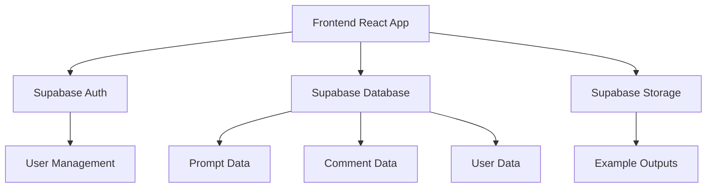
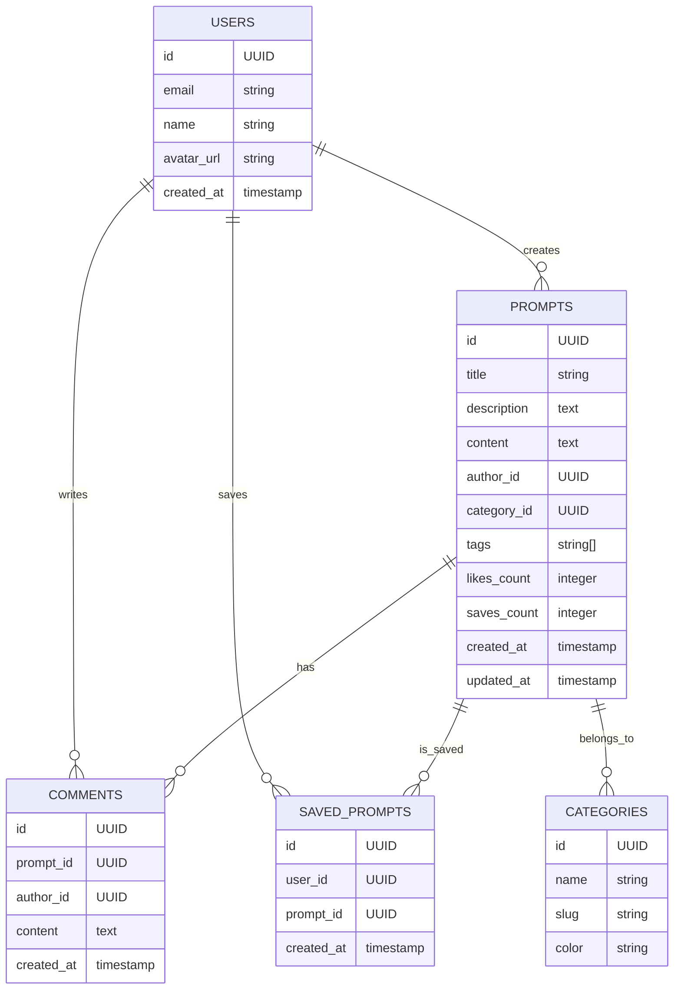

## 1. Architecture Design


## 2. Technology Description
- Frontend: React@18 + tailwindcss@3 + vite
- Initialization Tool: vite-init
- Backend: Supabase (Authentication, Database, Storage)
- Database: Supabase (PostgreSQL)
- State Management: Zustand
- UI Components: Custom components + Lucide icons

## 3. Route Definitions
| Route | Purpose |
|-------|---------|
| / | Home page with featured prompts and categories |
| /prompt/:id | Prompt detail page with content and comments |
| /create | Create new prompt page |
| /profile | User profile page with created and saved prompts |
| /login | Login page |
| /register | Registration page |

## 4. API Definitions
### 4.1 Supabase Client SDK
- Authentication: signUp, signIn, signOut, getSession
- Database: select, insert, update, delete
- Storage: upload, download, list

### 4.2 Frontend API Calls
| Function | Purpose |
|----------|---------|
| getPrompts() | Fetch all prompts with pagination |
| getPromptById(id) | Fetch single prompt by ID |
| createPrompt(data) | Create new prompt |
| updatePrompt(id, data) | Update existing prompt |
| deletePrompt(id) | Delete prompt |
| savePrompt(userId, promptId) | Save prompt to user's collection |
| unsavePrompt(userId, promptId) | Remove prompt from user's collection |
| addComment(promptId, content) | Add comment to prompt |
| getComments(promptId) | Fetch comments for prompt |

## 5. Server Architecture Diagram
Not applicable - using Supabase as backend service

## 6. Data Model
### 6.1 Data Model Definition


### 6.2 Data Definition Language
```sql
-- Create users table (managed by Supabase Auth)
-- Note: Supabase automatically creates this table

-- Create categories table
CREATE TABLE categories (
  id UUID PRIMARY KEY DEFAULT gen_random_uuid(),
  name TEXT NOT NULL,
  slug TEXT NOT NULL UNIQUE,
  color TEXT NOT NULL DEFAULT '#6366F1'
);

-- Create prompts table
CREATE TABLE prompts (
  id UUID PRIMARY KEY DEFAULT gen_random_uuid(),
  title TEXT NOT NULL,
  description TEXT,
  content TEXT NOT NULL,
  author_id UUID REFERENCES auth.users(id),
  category_id UUID REFERENCES categories(id),
  tags TEXT[] DEFAULT '{}',
  likes_count INTEGER DEFAULT 0,
  saves_count INTEGER DEFAULT 0,
  created_at TIMESTAMP WITH TIME ZONE DEFAULT NOW(),
  updated_at TIMESTAMP WITH TIME ZONE DEFAULT NOW()
);

-- Create comments table
CREATE TABLE comments (
  id UUID PRIMARY KEY DEFAULT gen_random_uuid(),
  prompt_id UUID REFERENCES prompts(id),
  author_id UUID REFERENCES auth.users(id),
  content TEXT NOT NULL,
  created_at TIMESTAMP WITH TIME ZONE DEFAULT NOW()
);

-- Create saved_prompts table
CREATE TABLE saved_prompts (
  id UUID PRIMARY KEY DEFAULT gen_random_uuid(),
  user_id UUID REFERENCES auth.users(id),
  prompt_id UUID REFERENCES prompts(id),
  created_at TIMESTAMP WITH TIME ZONE DEFAULT NOW(),
  UNIQUE(user_id, prompt_id)
);

-- Create indexes
CREATE INDEX idx_prompts_author_id ON prompts(author_id);
CREATE INDEX idx_prompts_category_id ON prompts(category_id);
CREATE INDEX idx_comments_prompt_id ON comments(prompt_id);
CREATE INDEX idx_saved_prompts_user_id ON saved_prompts(user_id);
CREATE INDEX idx_saved_prompts_prompt_id ON saved_prompts(prompt_id);

-- Insert initial categories
INSERT INTO categories (name, slug, color) VALUES
('Art', 'art', '#F43F5E'),
('Writing', 'writing', '#6366F1'),
('Coding', 'coding', '#10B981'),
('Design', 'design', '#F59E0B'),
('Business', 'business', '#8B5CF6');

-- Grant permissions
GRANT SELECT ON categories TO anon;
GRANT SELECT ON prompts TO anon;
GRANT SELECT ON comments TO anon;
GRANT ALL PRIVILEGES ON prompts TO authenticated;
GRANT ALL PRIVILEGES ON comments TO authenticated;
GRANT ALL PRIVILEGES ON saved_prompts TO authenticated;
```